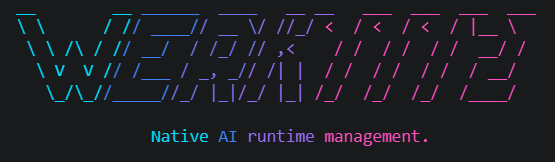

# Werk1112

<p align="center">
  
</p>

Werk1112 is a local-first AI runtime written in Rust.

It provides a unified inference router for modern language models through a stable CLI and an HTTP API compatible with the OpenAI API.

Applications target Werk1112. 

Werk1112 targets inference backends.

Modern AI applications should not need to care whether a model executes through llama.cpp, vLLM, Candle, MLX, or another runtime.

Werk1112 abstracts runtime selection while remaining predictable, transparent, and local-first.

## Why Werk1112?

Applications should depend on a stable AI runtime, not on individual inference engines.

Werk1112 provides a single runtime abstraction for model management, backend selection and inference while remaining compatible with existing AI tooling.

## What Werk1112 Is

Werk1112 is infrastructure for running local models with predictable routing:

- native CLI workflows for chat, inference, model management and serving
- a managed model store for copied local models and pulled Hugging Face repositories
- a runtime planner that chooses between llama.cpp server, vLLM, ONNX Runtime, Candle, and MLX based on model format and requested backend
- an HTTP API compatible with the OpenAI API for existing tools and integrations
- a stable runtime abstraction for local AI applications

Werk1112 does not ship a built-in GUI. CLI chat is a first-class workflow, and graphical interfaces can be provided by any client compatible with the OpenAI API.

## What Werk1112 Is Not

Werk1112 is intentionally narrow. It is not an agent framework, workflow engine, sandbox manager, IDE integration layer, or enterprise control plane.

Werk1112 intentionally focuses on model management, runtime selection and inference. Higher-level concerns belong in applications built on top of the runtime, not inside it.

## Product Scope

Werk1112 is responsible for:

- model import and model store management
- model listing and inspection
- backend and runtime selection
- local and companion-runtime inference
- OpenAI-compatible chat completion API
- CLI `chat`, `run`, and `serve` workflows

Werk1112 is not responsible for:

- agent orchestration
- long-running task planning
- sandbox orchestration
- workflow modelling
- IDE integrations
- enterprise management planes

This narrow scope keeps the runtime predictable, composable and easy to integrate into other applications.

## Design Philosophy

Werk1112 deliberately separates model management, runtime selection and inference from higher-level application logic.

Instead of becoming another monolithic AI platform, Werk1112 focuses on doing one job well: providing a reliable runtime abstraction for local AI workloads.

The goal is to let applications depend on a stable runtime abstraction instead of coupling themselves to backend-specific inference engines.

Werk1112 composes inference runtimes. It does not compete with them.

## Status

Current capabilities include:

The project focuses on stability, predictable runtime behaviour and long-term compatibility rather than rapidly expanding feature scope.

- Release artifacts are universal runtime-router binaries, one binary per supported OS/architecture.
- Prebuilt artifacts can start without CUDA, ROCm, Metal, MLX, vLLM, llama.cpp, ONNX Runtime, Python, Rust, or Cargo installed.
- Backend acceleration is discovered at runtime from the host system and installed companion runtimes.
- CUDA, CUDNN, Metal, MKL, Vulkan, Burn, and legacy llama.cpp are opt-in Cargo features for source/developer builds.
- `/v1/models` returns installed model manifests in an OpenAI-style model list.
- `/v1/chat/completions` accepts OpenAI-style chat requests.
- Streaming uses `text/event-stream` with `chat.completion.chunk` payloads and a final `data: [DONE]`.
- API streaming deltas are buffered into small text chunks instead of emitting every generated token as its own event.
- CLI chat streams decoded token-pieces by default so the answer appears progressively in the terminal.
- Local GGUF and safetensors model imports are copied into a managed model store.
- Hugging Face pulls use `git clone` for now, so install `git` and `git-lfs` for real model repos.

Current generation support is selected through the Werk1112 Runtime Planner. Werk1112 is an inference router, not a Candle wrapper: GGUF uses a persistent llama.cpp `llama-server` process as the hot path, so decode, sampling, KV cache, logits, and GPU execution stay inside llama.cpp. Supported HF safetensors directories prefer vLLM on CUDA, may use vLLM ROCm through `--backend rocm`, and use Candle as the compatibility fallback. MLX model directories can run through an external `mlx-lm` backend.

## Install

End users should prefer the installer scripts and prebuilt release artifacts. The installers are binary-only: they install the Werk1112 CLI binary and do not require Rust or Cargo. They do not install models, CUDA, ROCm, Metal, MLX, vLLM, llama.cpp, ONNX Runtime, Python, or other runtime dependencies. Companion runtimes are used only if already installed or provisioned later by Werk commands.

### Linux / macOS

```bash
sh -c "$(curl -fsSL https://raw.githubusercontent.com/phildenbo/werk1112/main/scripts/install.sh)"
```

Install a specific version:

```bash
WERK_VERSION=1.0.0 sh -c "$(curl -fsSL https://raw.githubusercontent.com/phildenbo/werk1112/main/scripts/install.sh)"
```

Custom install directory:

```bash
WERK_INSTALL_DIR="$HOME/bin" sh -c "$(curl -fsSL https://raw.githubusercontent.com/phildenbo/werk1112/main/scripts/install.sh)"
```

### Windows PowerShell

```powershell
irm https://raw.githubusercontent.com/phildenbo/werk1112/main/scripts/install.ps1 | iex
```

Install a specific version:

```powershell
$env:WERK_VERSION="1.0.0"; irm https://raw.githubusercontent.com/phildenbo/werk1112/main/scripts/install.ps1 | iex
```

Add the install directory to the user PATH:

```powershell
$env:WERK_ADD_TO_PATH="1"; irm https://raw.githubusercontent.com/phildenbo/werk1112/main/scripts/install.ps1 | iex
```

Source builds remain available for developers in the Build section.

## Quick Start

After installing `werk`, import or pull a model. The installer does not download models.

```bash
werk import /path/to/model-dir --name local-model
werk pull org/model-repo --name hf-model
```

Run one prompt or start an interactive terminal chat:

```bash
werk run local-model "Write one sentence about Rust."
werk chat local-model
```

Start the OpenAI-compatible HTTP server:

```bash
werk serve --model local-model
```

Then point compatible clients at:

```text
http://127.0.0.1:11434/v1
```

## Format Support

| Format | Typical Use | Import/List/Inspect | Backend Status |
| --- | --- | --- | --- |
| Safetensors | Hugging Face training/fine-tuning standard | Yes | vLLM CUDA for supported architectures; vLLM ROCm through `--backend rocm`; Candle CUDA/CPU/Metal compatibility fallback; MLX through `mlx-lm` when selected |
| GGUF | llama.cpp, Ollama, LM Studio, CPU inference | Yes | CUDA/ROCm/Vulkan/CPU through persistent llama.cpp server; Candle is legacy/fallback only |
| PyTorch (`.pt`, `.pth`, `pytorch_model.bin`) | Training, research, checkpoints | Yes | Catalog/import only; no generation backend yet |
| ONNX (`.onnx`) | Framework-independent inference | Yes | ONNX Runtime CUDA/ROCm/CPU when a runner is available |
| MLX (`.npz`, MLX-style dirs) | Apple Silicon / MLX-LM | Yes | Implemented through external `mlx-lm` backend when configured |
| TensorRT Engine (`.engine`, `.plan`) | NVIDIA-optimized inference | Yes | Catalog/import only; no generation backend yet |
| OpenVINO IR (`.xml` + `.bin`) | Intel CPUs, GPUs, NPUs | Yes | Catalog/import only; no generation backend yet |
| TensorFlow (`.ckpt`, `.pb`) | TensorFlow ecosystem | Yes | Catalog/import only; no generation backend yet |
| CoreML (`.mlmodel`, `.mlpackage`) | iOS/macOS deployment | Yes | Catalog/import only; no generation backend yet |

## Werk1112 Runtime Planner

Werk routes by requested backend, model format, model architecture, input capabilities, compiled features, and discovered companion runtimes. `--backend auto` may fall back to CPU. Explicit GPU requests such as `--backend cuda`, `--backend rocm`, or `--backend vulkan` do not silently fall back to CPU.

| Runtime | Formats | Accelerators | VLM | Status |
| --- | --- | --- | --- | --- |
| llama.cpp server | GGUF | CUDA, ROCm/HIP, Vulkan, CPU | Pending mmproj/image wiring | Primary GGUF hot path |
| vLLM | Selected HF safetensors | CUDA, ROCm through `--backend rocm` | Backend-dependent | Preferred route for supported HF safetensors architectures |
| ONNX Runtime | Managed ONNX artifacts/direct ONNX when selected | CUDA, ROCm, CPU | No | Explicit opt-in route |
| Candle | GGUF legacy, safetensors | CUDA, Metal, CPU | No | Implemented for selected architectures |
| MLX | MLX dirs, selected HF safetensors | Apple Silicon / MLX | Backend-dependent | Implemented through `mlx-lm` when configured |

Planner policy:

- GGUF routes to llama.cpp server CUDA, optional ROCm/HIP when detected for auto, Vulkan, or CPU first. Candle GGUF is legacy fallback/debug only.
- Safetensors routing is format-based: auto/CUDA prefer vLLM CUDA for supported architectures, then Candle compatibility fallback. Auto may use Candle CPU only after preferred GPU runtimes reject.
- `--backend vllm` is a strict vLLM-only safetensors route with the existing default vLLM accelerator behavior. ROCm-specific vLLM is selected through `--backend rocm`, and the probe requires a ROCm/HIP-capable PyTorch stack or an explicitly marked ROCm remote endpoint.
- `--backend cpu` is CPU-only, `--backend cuda` is CUDA-only, `--backend rocm` is ROCm-only, `--backend vulkan` is Vulkan-only, and `--backend candle` is an explicit Candle route.
- Image requests filter to VLM-capable runtimes before loading; Candle text routes reject image input.
- `--debug` prints the candidate runtime decisions and rejection reasons. `--verbose` stays focused on backend/timing stats.

## Build

Release builds use one target-specific Cargo alias per deployed end-user artifact. Those aliases build with `--no-default-features` and the target `release-*` feature bundle, producing universal runtime-router binaries. Prebuilt artifacts can start without CUDA, ROCm, Metal, MLX, vLLM, llama.cpp, ONNX Runtime, Python, Rust, or Cargo installed. Backend-specific acceleration is discovered at runtime from the host system and installed companion runtimes, and users can choose the active backend with `--backend`.

```bash
cargo install --path . --locked --force --no-default-features
```

Use `--locked` for source installs. Without it, Cargo may resolve newer crates than the checked-in lockfile and require a different binding surface than the one this repo was verified with.

If a linker error still mentions a feature that is no longer enabled, such as `-lnccl` or `llama_cpp_sys`, clear the release build artifacts, not the global Cargo registry:

```bash
cargo clean --release
```

For a portable CPU-only development binary, opt out of default features:

```bash
cargo check --locked --no-default-features
cargo build-cpu
```

Target release builds:

```bash
cargo build-windows
cargo build-linux
cargo build-macos-apple-silicon
```

Run target release aliases on the matching build OS/toolchain when cross-compilation is unavailable. In practice:

- Run `cargo build-windows` from native Windows PowerShell with the MSVC Rust toolchain.
- Run `cargo build-linux` from Linux or WSL.
- Run `cargo build-macos-apple-silicon` on Apple Silicon macOS.

Do not use WSL to produce the Windows artifact. WSL can build the Linux artifact.

These aliases expand to normal Cargo target builds:

```text
cargo build-windows              -> no default features + x86_64-pc-windows-msvc + release-windows
cargo build-linux                -> no default features + x86_64-unknown-linux-gnu + release-linux
cargo build-macos-apple-silicon  -> no default features + aarch64-apple-darwin + release-macos-apple-silicon
```

Cargo aliases are subcommands, so the command is `cargo build-windows`, not `cargo build windows`.

If a target build fails with `E0463` / `can't find crate for core` or many dependencies fail immediately, the Rust standard library for that target is not installed in the active toolchain. The checked-in `rust-toolchain.toml` lists the supported release targets, but native target OS builds may still be required when cross-compilation tooling is unavailable.

Release feature bundles:

| Bundle | Release binary model | Runtime-discovered acceleration |
| --- | --- | --- |
| `release-windows` | Universal router, no backend-specific Cargo features | CUDA, ROCm, vLLM, ONNX Runtime, and llama.cpp server when available on the host |
| `release-linux` | Universal router, no backend-specific Cargo features | CUDA, ROCm, vLLM, ONNX Runtime, and llama.cpp server when available on the host |
| `release-macos-apple-silicon` | Universal router, no backend-specific Cargo features | MLX, ONNX Runtime, and llama.cpp server when available on the host |

Raw Cargo equivalents:

```bash
cargo build --release --locked --no-default-features --target x86_64-pc-windows-msvc --features release-windows
cargo build --release --locked --no-default-features --target x86_64-unknown-linux-gnu --features release-linux
cargo build --release --locked --no-default-features --target aarch64-apple-darwin --features release-macos-apple-silicon
```

Universal release builds do not compile CUDA, ROCm, Metal, or other backend-specific Cargo features, so they do not require NVIDIA drivers, CUDA toolkits, `nvcc`, Python, or companion runtimes just to start. Those requirements apply only to explicit custom source builds. For a CUDA-enabled source build, point Cargo at the intended installed toolkit:

```bash
export CUDA_HOME=/usr/local/cuda-13.0
export CUDA_ROOT=/usr/local/cuda-13.0
export CUDA_PATH=/usr/local/cuda-13.0
export CUDA_TOOLKIT_ROOT_DIR=/usr/local/cuda-13.0
export PATH="$CUDA_HOME/bin:$PATH"
export LD_LIBRARY_PATH="$CUDA_HOME/lib64:${LD_LIBRARY_PATH:-}"

nvcc --version
cargo install --path . --locked --force --features cuda
```

If the CUDA build then fails because NVML cannot query the GPU, set the compute capability manually. For example, an RTX 30xx/Ampere `sm_86` GPU uses:

```bash
export CUDA_COMPUTE_CAP=86
cargo install --path . --locked --force --features cuda
```

For a CUDA-enabled local install with an explicit feature selection, make sure the newer CUDA toolkit is first:

```bash
sudo apt-get update
sudo apt-get install -y clang libclang-dev

export CUDA_HOME=/usr/local/cuda-13.0
export CUDA_ROOT=/usr/local/cuda-13.0
export CUDA_PATH=/usr/local/cuda-13.0
export CUDA_TOOLKIT_ROOT_DIR=/usr/local/cuda-13.0
export PATH="$CUDA_HOME/bin:$PATH"
export LD_LIBRARY_PATH="$CUDA_HOME/lib64:${LD_LIBRARY_PATH:-}"

cargo install --path . --locked --force --features cuda
```

If you are building the explicit legacy in-process llama.cpp FFI CUDA backend inside WSL with Ubuntu's CUDA 11.5 package, `nvcc` may fail inside `llama_cpp_sys` with errors from `/usr/include/c++/11/bits/std_function.h`. That means CUDA 11.5 is using GCC 11 as the host compiler. The repository Cargo config defaults Linux CUDA builds to GCC/G++ 10, so install those once:

```bash
sudo apt-get install -y gcc-10 g++-10

cargo install --path . --locked --force --features llama-legacy-cuda
```

To override that default, set `CC_x86_64_unknown_linux_gnu` or `CXX_x86_64_unknown_linux_gnu` in your shell before running Cargo.

If the build fails in `candle-kernels` with `fatal error: cuda_fp8.h: No such file or directory`, the active CUDA toolkit is too old for Candle CUDA. Install a newer CUDA toolkit and make sure its `bin` and `include` directories come before Ubuntu's `/usr` CUDA package. For a CPU-only development build, use `cargo install --path . --locked --force --no-default-features`.

Native Windows CUDA source build / Developer PowerShell:

1. Install Rust for Windows with `rustup`.
2. Install Visual Studio Build Tools with the `Desktop development with C++` workload.
3. Install Git, Git LFS, LLVM/libclang, and a Windows CUDA Toolkit.
4. Open native Windows Developer PowerShell, not a WSL shell.
5. Build from a Windows filesystem path such as `C:\dev\werk1112`, not from `\\wsl$\...`.

If `rustup default stable-x86_64-pc-windows-msvc` says the toolchain may not be able to run on this system, the command is being run from WSL/Linux. Close that shell and run the Windows source build from PowerShell on Windows.

If PowerShell says `rustup` was not recognized, Rust is not installed for Windows or `%USERPROFILE%\.cargo\bin` is not on `PATH`. Install Rust on Windows, reopen PowerShell, and verify `rustup --version`.

If the PowerShell prompt starts in `\\wsl.localhost\...`, move or clone the project into a Windows path before building:

```powershell
cd C:\dev
git clone <repo-url> werk1112
cd C:\dev\werk1112
```

Build a native Windows CUDA source binary:

```powershell
cd C:\dev\werk1112

rustup default stable-x86_64-pc-windows-msvc
git lfs install
nvidia-smi

$vswhere = Join-Path ${env:ProgramFiles(x86)} "Microsoft Visual Studio\Installer\vswhere.exe"
$vsInstall = & $vswhere -latest -products * -requires Microsoft.VisualStudio.Component.VC.Tools.x86.x64 -property installationPath
if (-not $vsInstall) {
  throw "Visual Studio C++ build tools not found. Install Visual Studio Build Tools with Desktop development with C++."
}

Import-Module (Join-Path $vsInstall "Common7\Tools\Microsoft.VisualStudio.DevShell.dll")
Enter-VsDevShell -VsInstallPath $vsInstall -SkipAutomaticLocation -DevCmdArguments "-arch=x64 -host_arch=x64"

$cudaRoot = "C:\Program Files\NVIDIA GPU Computing Toolkit\CUDA"
$env:CUDA_HOME = Get-ChildItem $cudaRoot -Directory |
  Sort-Object Name -Descending |
  Select-Object -First 1 -ExpandProperty FullName

if (-not $env:CUDA_HOME) {
  throw "CUDA Toolkit not found under $cudaRoot. Install the CUDA Toolkit, not only the NVIDIA driver."
}

$env:CUDA_ROOT = $env:CUDA_HOME
$env:CUDA_PATH = $env:CUDA_HOME
$env:CUDA_TOOLKIT_ROOT_DIR = $env:CUDA_HOME
$env:CUDA_COMPUTE_CAP = "86"
$env:Path = "$env:CUDA_HOME\bin;$env:Path"
$env:CL = "/Zc:preprocessor"

if (-not (Test-Path "$env:CUDA_HOME\bin\nvcc.exe")) {
  throw "nvcc.exe not found in $env:CUDA_HOME\bin. Check the CUDA Toolkit installation."
}

where.exe cl
$clPath = (Get-Command cl.exe).Source
if ($clPath -notmatch "\\Hostx64\\x64\\cl\.exe$") {
  throw "MSVC is not in x64 mode. Re-run Enter-VsDevShell with -arch=x64 -host_arch=x64, or open the x64 Native Tools shell."
}
$env:NVCC_CCBIN = Split-Path $clPath
cl
where.exe nvcc
nvcc --version
cargo build --release --locked --features cuda
```

The release binary is written to Cargo's target directory:

```text
target/x86_64-pc-windows-msvc/release/werk.exe
target/x86_64-unknown-linux-gnu/release/werk
target/aarch64-apple-darwin/release/werk
```

Runtime backend setup should be a black box for end users. GGUF execution uses a persistent llama.cpp server backend so the decode loop, sampling, KV cache, logits, and GPU execution stay inside llama.cpp. For vLLM-supported HF safetensors architectures on CUDA, vLLM is tried before Candle. Candle is the compatibility fallback instead of the primary target. In `--backend auto`, Werk skips unavailable runtimes quietly and uses the best working fallback; `--debug` and `werk backend doctor --debug` print detailed probe rejection reasons. Source builds may need managed or PATH-provided companion runtimes for llama.cpp/ONNX/vLLM; use `werk backend list`, `werk backend doctor --debug`, `werk backend install llama-cuda`, and `werk artifacts build <model>` for local development. `WERK_LLAMA_CTX`, `WERK_LLAMA_BATCH`, `WERK_LLAMA_UBATCH`, and `WERK_LLAMA_MAIN_GPU` are advanced GGUF tuning overrides. `WERK_LLAMA_SERVER_ROCM` can point to a ROCm/HIP llama.cpp server. `WERK_ONNX_RUNTIME_CUDA`, `WERK_ONNX_RUNTIME_ROCM`, `WERK_ONNX_RUNTIME_CPU`, `WERK_ONNX_RUNTIME`, `WERK_ONNX_RUNTIME_BUNDLE_CUDA`, `WERK_ONNX_RUNTIME_BUNDLE_ROCM`, `WERK_ONNX_RUNTIME_BUNDLE_CPU`, and `WERK_ONNX_EXPORTER` are advanced ONNX artifact/runtime overrides. `WERK_VLLM_PYTHON`, `WERK_VLLM_HOST`, `WERK_VLLM_PORT`, `WERK_VLLM_ACCELERATOR=rocm`, `WERK_VLLM_ROCM=1`, and `WERK_VLLM_ARGS` are available for managed and explicit vLLM routes. The MLX backend uses `python3 -m mlx_lm.generate` or `WERK_MLX_PYTHON`. VLM request/image support is compiled into every build; actual multimodal generation depends on the chosen model and backend.

Additional low-level acceleration features are available for custom builds:

```bash
cargo build --release --locked --features mkl
cargo build --release --locked --features candle-cuda
cargo build --release --locked --features cuda,cudnn
```

The top-level `cuda` feature means CUDA support across the proven Werk CUDA paths: Candle CUDA plus the external persistent llama.cpp server route for GGUF. It does not compile the old in-process llama.cpp FFI CUDA backend. It is included by the default `recommended` feature and can still be requested explicitly:

```bash
cargo install --path . --locked --force --features cuda
```

Burn is experimental and absent from normal routing unless compiled with `burn-experimental`. Burn CUDA is available as an explicit developer feature:

```bash
cargo install --path . --locked --force --features burn-cuda
```

`cargo build --release ...` only creates `target/release/werk`; it does not replace the `werk` on your PATH. After a build, run `./target/release/werk ...` or use `cargo install --path . --locked --force --features burn-cuda` to replace `~/.cargo/bin/werk`.

For a custom no-default experimental build that still includes the recommended CUDA/Candle path plus Burn CPU and Burn CUDA:

```bash
cargo install --path . --locked --force --no-default-features --features cuda,burn-cpu,burn-cuda
```

Burn CUDA uses CubeCL, which currently links NCCL through `cudarc`. Install native CUDA and NCCL libraries through the system package manager or provide native `CUDA_HOME`/`NCCL_HOME` paths. Burn does not use Python, pip, or Python site-packages for GPU libraries; Python remains limited to explicit Python runtimes such as vLLM. When `burn-experimental` is compiled, `werk backend doctor --debug` reports whether the binary was compiled with Burn CUDA, whether WSL/Linux is loading a real `libcuda` instead of CUDA stubs, whether `libcudart` and `libnccl` are discoverable, and whether the Burn CUDA tensor smoke test passes. Use the checked-in lockfile for source installs so the CUDA binding surface remains reproducible.

The old in-process llama.cpp FFI CUDA backend is also explicit:

```bash
cargo install --path . --locked --force --features llama-legacy-cuda
```

Normal GGUF CUDA usage does not need that feature. Use `werk backend install llama-cuda` to provision the persistent llama.cpp server backend instead.

The lower-level `candle-cuda` feature is still available for custom builds that only need Candle CUDA without llama.cpp CUDA. `cudnn` builds on Candle CUDA. These features may require CUDA headers such as `cuda_fp8.h`, which are not present in Ubuntu's CUDA 11.5 package.

Build features decide what Candle, llama.cpp, and experimental Burn acceleration support is compiled into the binary. Backend selection is a separate CLI option and is the preferred way to choose how a process runs:

```bash
werk --backend auto chat gemma-2b-it
werk --backend cpu chat gemma-2b-it
werk --backend cuda chat gemma-2b-it
werk --backend rocm chat Qwen3-14B
werk --backend metal chat gemma-2b-it
werk --backend vulkan chat TinyLLama-1B-GGUF
werk --backend mlx chat mlx-model
werk --backend candle chat debug-model
werk --backend onnx chat phi-3-mini-4k-instruct
werk --backend vllm chat phi-3-mini-4k-instruct
werk --backend cuda serve --model gemma-2b-it
```

`--backend auto` is format-aware. For GGUF on Windows/Linux it tries llama.cpp server CUDA, includes ROCm/HIP only when a ROCm-specific signal or managed ROCm server is present, then Vulkan, CPU, and Candle legacy GPU/CPU fallback. For safetensors it tries vLLM for supported CUDA architectures, then Candle CUDA, then Candle CPU as an auto-only fallback. Normal chat/run output skips noisy unavailable runtime diagnostics; use `--debug` or `werk backend doctor --debug` for attempted runtimes and probe rejection reasons. On Apple Silicon it prefers MLX for MLX models and may use MLX or Candle for safetensors depending on availability.

For GGUF models, `--backend cuda`, `--backend rocm`, `--backend vulkan`, and `--backend cpu` use the matching persistent llama.cpp server backend when that server is available. For safetensors models, CUDA tries vLLM CUDA for supported architectures and then Candle CUDA; ROCm tries only vLLM ROCm and verifies the discovered vLLM environment is ROCm/HIP-capable. CPU uses Candle CPU. `--backend onnx` is strict ONNX Runtime only: it never falls back to Candle and fails with actionable diagnostics if no runner is installed. `--backend vllm` remains a strict vLLM-only route with the existing default vLLM accelerator behavior and fails clearly if vLLM is missing, broken, or cannot load the model. Explicit GPU backend requests do not silently fall back to CPU; they fail with an actionable error if the requested runtime is unavailable. `--backend candle` is available for debugging or fallback verification. `--device` remains as a Candle-only compatibility override, but `--backend` is what end users should use.

## Packaging Release Artifacts

Release artifacts are written to `releases/`.

```bash
./scripts/package-release.sh linux
./scripts/package-release.sh windows
./scripts/package-release.sh macos
./scripts/package-release.sh all
```

Artifacts:

```text
releases/werk1112-v<VERSION>-linux-x86_64.tar.gz
releases/werk1112-v<VERSION>-windows-x86_64.zip
releases/werk1112-v<VERSION>-macos-aarch64.tar.gz
```

Each artifact has a `.sha256` checksum file. Release artifacts are universal runtime-router binaries, one per supported OS/architecture. Build them on the matching target OS/toolchain when cross-compilation is unavailable.

## Model Store

The model store is resolved in this order:

1. `WERK_HOME`
2. `$XDG_DATA_HOME/werk1112`
3. Native Windows: `%LOCALAPPDATA%\werk1112`
4. Native Windows fallback: `%USERPROFILE%\AppData\Local\werk1112`
5. Unix fallback: `~/.local/share/werk1112`

Each imported or pulled model is stored under `models/<model-id>/` inside that store. On a default Linux setup, a pulled model named `TinyLLama-1B-GGUF` is saved here:

```text
~/.local/share/werk1112/models/TinyLLama-1B-GGUF/
├── manifest.json
├── files/
│   └── ...
└── artifacts/
    └── onnx/
```

On native Windows, the same model is saved here by default:

```text
%LOCALAPPDATA%\werk1112\models\TinyLLama-1B-GGUF\
```

`manifest.json` contains source, format, architecture, tokenizer/config paths, model file path, checksums, backend hints, and optimized artifact metadata. `files/` contains the copied local model files or downloaded Hugging Face files. `artifacts/` contains generated runtime artifacts such as ONNX exports.

For GGUF repositories that contain many quantizations, new imports prefer a balanced `Q4_K_M` file when it is present instead of taking the first filename alphabetically. The selected file is stored in `manifest.json` as `model_path`, and both `chat` and `serve` use that selected file.

## CLI

Install the CLI from this checkout with the recommended runtime stack:

```bash
cargo install --path . --locked
```

From another directory, pass the project path with `--path`:

```bash
cargo install --path ../client --locked
```

After install, use the command directly:

```bash
werk --help
werk serve --help
```

During development, you can also run the local CPU-only binary without installing:

```bash
cargo run --no-default-features -- <command>
```

Start the server:

```bash
werk serve
```

`serve` starts an OpenAI-compatible API. It exposes all installed models through `/v1/models`; each API request normally chooses the model with its JSON `model` field.

Set a default model for requests that omit `model`:

```bash
werk serve --model gemma-2b-it
```

The default address is:

```text
http://127.0.0.1:11434
```

Override address:

```bash
werk serve --host 0.0.0.0 --port 11434
```

Import a local model file or directory. Files are copied into the managed model store:

```bash
werk import /path/to/model-dir --name llama-local
```

Pull from Hugging Face:

```bash
werk pull org/model-repo --name model-local
```

Pull one file from a Hugging Face repository, useful for GGUF repos that contain many quantizations:

```bash
werk pull TheBloke/TinyLlama-1.1B-Chat-v1.0-GGUF \
  --file tinyllama-1.1b-chat-v1.0.Q4_K_M.gguf \
  --name TinyLlama-1B-GGUF
```

Pull shows live status for each phase. The first phase clones Git metadata with `GIT_LFS_SKIP_SMUDGE=1`; the second phase runs `git lfs pull` and shows `downloading` with either Git LFS percent/speed or a running local bytes/s estimate while Git LFS is quiet. After the download completes, the CLI shows an import step while files are copied into the managed model store.

Build, list, or rebuild optimized runtime artifacts for a safetensors model:

```bash
werk artifacts build phi-3-mini-4k-instruct
werk artifacts list phi-3-mini-4k-instruct
werk artifacts rebuild phi-3-mini-4k-instruct
```

When an explicit ONNX Runtime route is selected and no ready ONNX artifact exists, Werk attempts the same managed artifact build automatically. Auto SafeTensors routing uses vLLM/Candle and does not require ONNX artifacts. Set `WERK_ONNX_EXPORTER` to a custom exporter binary, or install `optimum-cli` / `optimum.exporters.onnx` for the default exporter path.

Remove an installed model from Werk's managed store. This deletes the managed copy under `WERK_HOME`; it does not delete the original local import source or any upstream Hugging Face repository:

```bash
werk remove model-local
werk rm model-local
```

List installed models:

```bash
werk list
```

Inspect a model manifest:

```bash
werk inspect llama-local
```

Switch an already-installed model to another tracked model file:

```bash
werk select-file TinyLLama-1B-GGUF tinyllama-1.1b-chat-v1.0.Q4_K_M.gguf
```

Use `werk inspect TinyLLama-1B-GGUF` to see the exact filenames under `files`. The `select-file` command accepts either `tinyllama-1.1b-chat-v1.0.Q4_K_M.gguf` or `files/tinyllama-1.1b-chat-v1.0.Q4_K_M.gguf`.

Use a custom store for any command:

```bash
werk --model-home /tmp/werk-store list
```

Run one prompt from the terminal:

```bash
werk run gemma-2b-it "Write one sentence about Rust." --max-tokens 64
```

Start an interactive terminal chat:

```bash
werk chat gemma-2b-it --max-tokens 128
```

`--max-tokens` is a hard cap on generated completion tokens. If you set `--max-tokens 32`, the model may stop mid-sentence because the decoder reached the limit, not because the answer is complete. Use a larger value such as `--max-tokens 64` or `--max-tokens 128` for normal chat.

Terminal chat prints decoded token-pieces as soon as the backend produces them, so text appears progressively after `assistant>`. To reduce terminal flushes, switch back to chunked output:

```bash
werk chat gemma-2b-it --stream-granularity chunk
```

Timing and throughput stats are quiet by default. Add `--verbose` to `run` or `chat` for runtime timing stats:

```bash
werk chat TinyLlama-1B-GGUF --max-tokens 128 --verbose
```

Example verbose output:

```text
total duration:       461.318ms
load duration:        139.4804ms
prompt eval count:    41 token(s)
prompt eval duration: 43.805ms
prompt eval rate:     935.97 tokens/s
eval count:           21 token(s)
eval duration:        241.897ms
eval rate:            86.81 tokens/s
```

`prompt eval` is prompt/prefill time. `eval` is assistant-token decode time. `total` also includes model load and tokenizer overhead for that turn. For TinyLlama GGUF on a CUDA build, use `Q4_K_M` as the default balance of speed and quality; `Q2_K` is smaller but noticeably worse, and larger quants can be slower.

CLI chat is a first-class workflow. The HTTP API allows existing applications compatible with the OpenAI API to integrate with Werk1112 without additional adapters.

## OpenAI-Compatible API

Configure compatible clients with this base URL:

```text
http://127.0.0.1:11434/v1
```

List models:

```bash
curl http://127.0.0.1:11434/v1/models
```

Non-streaming chat completion:

```bash
curl http://127.0.0.1:11434/v1/chat/completions \
  -H 'Content-Type: application/json' \
  -d '{
    "model": "llama-local",
    "messages": [
      {"role": "user", "content": "Write one sentence about Rust."}
    ],
    "temperature": 0.7,
    "max_completion_tokens": 32
  }'
```

Non-streaming calls do not print anything until the full completion is finished. For large models on CPU, prefer streaming while testing.

Streaming chat completion:

```bash
curl -N http://127.0.0.1:11434/v1/chat/completions \
  -H 'Content-Type: application/json' \
  -d '{
    "model": "llama-local",
    "stream": true,
    "messages": [
      {"role": "user", "content": "Write one sentence about Rust."}
    ],
    "max_completion_tokens": 32
  }'
```

The stream sends chunks like:

```text
data: {"object":"chat.completion.chunk",...,"delta":{"role":"assistant"}}
data: {"object":"chat.completion.chunk",...,"delta":{"content":"Rust is a systems"}}
data: {"object":"chat.completion.chunk",...,"delta":{"content":" programming language..."}}
data: {"object":"chat.completion.chunk",...,"finish_reason":"stop"}
data: [DONE]
```

Text deltas are intentionally chunked. They are not one event per token.

## End-User Releases

Release artifacts should be produced with the target Cargo alias on the target platform. Each release contains the Cargo-built `werk` binary and documentation, not backend-specific companion runtime packages. End users should not need CUDA, ROCm, Metal, MLX, vLLM, llama.cpp, ONNX Runtime, Python, Rust, Cargo, Visual Studio, CMake, Git, libclang, or `nvcc` for the binary to start.

Do not ship one artifact per backend. Release artifacts are universal runtime-router binaries; backend-specific acceleration is discovered from the host system and installed companion runtimes. Legacy in-process llama.cpp FFI CUDA/Vulkan builds are debug/developer features, not the normal release route.

Each target artifact keeps the same artifact name regardless of available host acceleration:

| Platform | Cargo command | Artifact |
| --- | --- | --- |
| Windows 10/11 x64 | `cargo build-windows` | `werk1112-v<VERSION>-windows-x86_64.zip` |
| Linux x64 | `cargo build-linux` | `werk1112-v<VERSION>-linux-x86_64.tar.gz` |
| macOS Apple Silicon | `cargo build-macos-apple-silicon` | `werk1112-v<VERSION>-macos-aarch64.tar.gz` |

Backend selection is per process. If CUDA, ROCm, MLX, vLLM, ONNX Runtime, or llama.cpp server support is available on the host, Werk may use it. If not, Werk continues to run and follows the runtime planner fallback policy. Managed runtime provisioning and generated artifacts are cached under `WERK_HOME` when users explicitly invoke those Werk workflows.

```bash
werk --backend auto chat model-id
werk --backend cuda chat model-id
werk --backend rocm chat model-id
werk --backend vulkan chat model-id
werk --backend mlx chat model-id
werk --backend metal chat model-id
werk --backend cpu chat model-id
werk --backend candle chat model-id
werk --backend onnx chat model-id
werk --backend vllm chat model-id
```

`auto` is format-aware: GGUF uses llama.cpp server acceleration when discoverable, then CPU and legacy fallbacks according to the planner; safetensors can use vLLM or Candle according to host capabilities and compiled source-build features; MLX-format models use MLX when available. Explicit `onnx`, `vllm`, and GPU requests do not fallback to CPU. `--backend rocm` is strict ROCm/HIP for compatible formats.

MLX and Metal are not the same backend. Metal is implemented through Candle. MLX is implemented as an external `mlx-lm` backend. CUDA, Vulkan, and CPU GGUF hot paths are implemented through persistent llama.cpp server backends. `WERK_MLX_PYTHON` can point to a Python environment with `mlx-lm` installed.

VLM support means multimodal model/request support, not a separate backend. Today image inputs should be routed to an image-capable MLX/VLM backend. Candle is text-only, and llama.cpp VLM support is pending until mmproj/image argument handling is wired.

CLI image inputs use repeatable `--image` flags:

```bash
werk --backend mlx chat vlm-model --image ./image.png
```

OpenAI-style API image inputs are accepted from `image_url` and `input_image` content parts. Text-only backends return a clear error when image inputs are provided.
