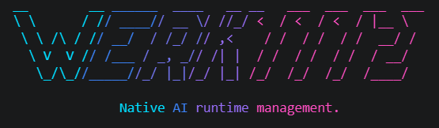

# Werk1112

  

Werk1112 is a local-first, multimodal inference router written in Rust.
Applications use one CLI and HTTP service; Werk resolves models, parameters,
hardware and installed runtimes, then selects an executable backend.

Werk supports text, image, video and audio workflows without coupling clients
to llama.cpp, vLLM, Candle, MLX, ONNX Runtime, Diffusers, Transformers or
architecture-specific companion runtimes.

## Core capabilities

- managed local and Hugging Face model store
- explicit or automatic runtime and accelerator selection
- typed chat, image, video and audio commands
- workload estimation, parameter validation and provenance
- an OpenAI-compatible subset plus Werk-native media and job APIs
- optional ComfyUI nodes with native IMAGE, VIDEO and AUDIO values

Werk is an inference router, not an agent framework, workflow engine or GUI.

## Status

Werk1112 is under active development. Model discovery is broader than model
execution: a repository may be imported and classified even when no installed
runtime can execute its architecture. Use the following before a large run:

~~~bash
werk inspect MODEL
werk doctor --model MODEL --task TASK --debug
~~~

The detailed support levels and known gaps are documented rather than hidden
behind an “all models supported” claim.

## Install

End-user installers install the Werk binary only. Models, drivers, Python
packages and optional inference runtimes remain separate.

Linux or macOS:

~~~bash
sh -c "$(curl -fsSL https://raw.githubusercontent.com/philipbodenbach/werk1112/main/scripts/install.sh)"
~~~

Windows PowerShell:

~~~powershell
irm https://raw.githubusercontent.com/philipbodenbach/werk1112/main/scripts/install.ps1 | iex
~~~

Install from source:

~~~bash
cargo +stable install --path . --locked
~~~

Installer options, first-model setup and uninstall behavior are documented in
[Getting started](docs/getting-started.md).

Target-specific source builds use the checked-in Cargo aliases
`build-linux`, `build-windows`, and `build-macos-apple-silicon` on the matching
host platform. See [Building from source](docs/development/build.md) for the
feature graph, platform prerequisites and troubleshooting.

## Quick start

Import a local model or pull a Hugging Face repository:

~~~bash
werk import /path/to/model --name local-model
werk pull org/model-repository --name model-name
werk list
werk inspect model-name
~~~

Run text and media inference:

~~~bash
werk chat local-model

werk image generate IMAGE_MODEL \
  --prompt "A quiet orbital greenhouse"

werk video generate VIDEO_MODEL \
  --prompt "Sunlight breaking through a forest canopy"

werk audio generate speech TTS_MODEL \
  --text "Werk elf zwölf ist bereit." \
  --output speech.wav
~~~

Werk chooses among accepted runtimes when the backend is <code>auto</code>.
Use verbose diagnostics to see the effective request and decision:

~~~bash
werk video generate VIDEO_MODEL \
  --prompt "Clouds moving above a mountain ridge" \
  --backend auto --verbose --debug
~~~

## Backend management

Inspect discovered runtimes and their prerequisites:

~~~bash
werk backend list
werk backend doctor --debug
~~~

Managed installers are explicit:

~~~bash
werk backend install llama-cuda
werk backend install llama-cpu
werk backend install vllm
werk backend install qwen-tts
~~~

Installation support is not the same as verified model execution on every
operating system. See [Backends, installation and platform support](docs/backends.md)
for the complete matrix, fallback rules, managed paths and current uninstall
limitations.

## HTTP service

Authentication is enabled by default:

~~~bash
werk auth api-key generate
export WERK_API_KEY="replace-with-generated-key"
werk serve --model local-model
~~~

OpenAI-compatible clients use:

~~~text
http://127.0.0.1:11434/v1
~~~

Werk exposes an OpenAI-compatible chat subset, OpenAI-inspired media routes,
Werk-native discovery/jobs/outputs and a small AUTOMATIC1111 compatibility
surface. These classes are intentionally documented separately.

~~~bash
curl -fsS http://127.0.0.1:11434/v1/models \
  -H "Authorization: Bearer $WERK_API_KEY"
~~~

See the [HTTP API reference and coverage matrix](docs/api.md) for all 23
method/path operations, exact request fields, task coverage, responses,
authentication, limits, persistence and known gaps.

## Documentation

| Topic | Document |
| --- | --- |
| Documentation home and wiki roadmap | [docs/README.md](docs/README.md) |
| Installation and first run | [docs/getting-started.md](docs/getting-started.md) |
| CLI command groups and semantics | [docs/reference/cli.md](docs/reference/cli.md) |
| HTTP API contract and coverage | [docs/api.md](docs/api.md) |
| Backends, routing, installation and OS support | [docs/backends.md](docs/backends.md) |
| Tasks, modalities, repository layouts and formats | [docs/reference/tasks-and-formats.md](docs/reference/tasks-and-formats.md) |
| Models, manifests and managed storage | [docs/concepts/models-manifests-and-store.md](docs/concepts/models-manifests-and-store.md) |
| Environment-variable index | [docs/reference/environment-variables.md](docs/reference/environment-variables.md) |
| Media tasks, parameters, jobs and examples | [docs/media-inference.md](docs/media-inference.md) |
| Building from source | [docs/development/build.md](docs/development/build.md) |
| Packaging and releases | [docs/development/packaging-releases.md](docs/development/packaging-releases.md) |
| Client integration guides | [docs/README.md#integrations](docs/README.md#integrations) |
| ComfyUI custom nodes | [utils/comfyUI/README.md](utils/comfyUI/README.md) |

The versioned files under <code>docs/</code> are the source of truth. A public
wiki may mirror tutorials later, but should not replace versioned API and
backend contracts.

## Platform overview

Prebuilt Werk artifacts currently target:

- Linux x86_64
- Windows x86_64
- macOS Apple Silicon

Runtime support depends on the backend, accelerator and upstream packages.
For example, llama.cpp Metal is macOS-only, local vLLM is native-Linux-only,
and Qwen-TTS currently has Linux with NVIDIA CUDA as its primary documented
path. The detailed and experimental combinations are listed in
[docs/backends.md](docs/backends.md).

## Development

Common checks:

~~~bash
cargo +stable fmt --all --check
cargo +stable check --all-targets
cargo +stable test
python -m unittest runtime.test_werk_media_companion
python -m pytest utils/comfyUI/tests
~~~

The project deliberately keeps optional backend dependencies outside the main
Werk process where version conflicts would otherwise affect unrelated
architectures.

## License

Werk1112 is licensed under the [Apache License 2.0](LICENSE). Individual model
repositories and third-party runtimes retain their own licenses.
